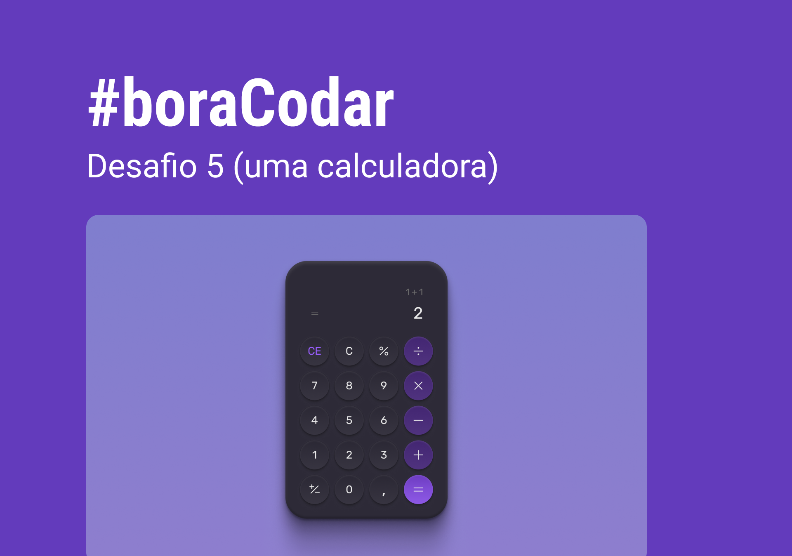

<h1 align="center"> Calculator </h1>

#boraCodar are weekly challenges, promoted by Rocketseat for teaching WEB technologies.  

  <a href="#-technologies">Technologies</a>&nbsp;&nbsp;&nbsp;|&nbsp;&nbsp;&nbsp;
  <a href="#-layout">Layout</a>&nbsp;&nbsp;&nbsp;|&nbsp;&nbsp;&nbsp;
  <a href="#license-memo">License</a>

  

 

  

## 🚀 Technologies

This project was developed with the following technologies:

- HTML and CSS
- Git and Github
- Figma

## 🔖 Layout

You can view the layout of the project through [THIS LINK](https://www.figma.com/community/file/1202607074523509182). You must have an account at [Figma](https://figma.com) to access it.

## :memo: License

This project is licensed under the MIT license.

---

Made with ♥ by Rocketseat :wave: [Join our community!](https://discord.gg/rocketseat)
