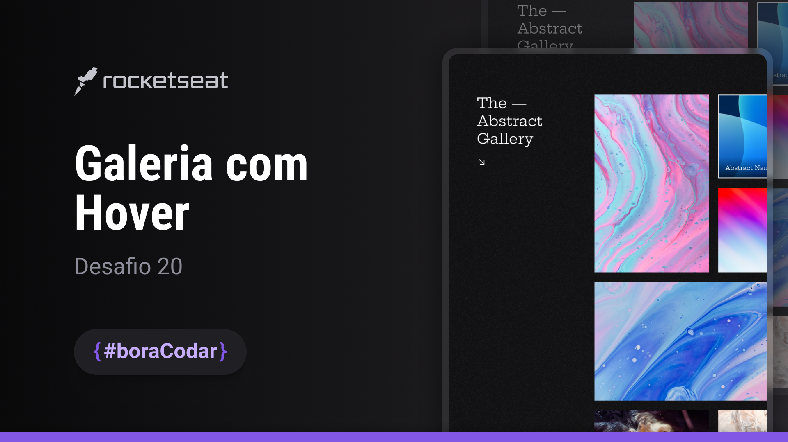
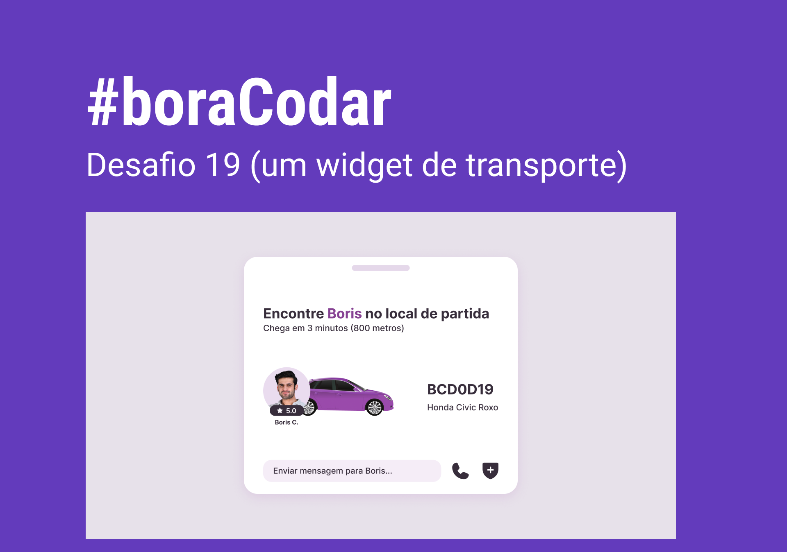

# boraCodar

Rocketseat's Bora Codar challenge project repository

[Access the challenges by clicking here](https://sestevao.github.io/boraCodar/)

<table>
    <thead>
        <tr>
            <th align="center">
                 
                

                    <small>#</small>
                

            </th>
            <th align="center">
                 
                
 
                    <small>
                        CODE
                    </small>
                

            </th>
            <th align="left">
                
                
 
                    <small>
                    RELEASE DATE
                    </small>
                

            </th>
            <th align="center">
                
                
 
                    <small>
                    PREVIEW
                    </small>
                

            </th>
        </tr>
    </thead>
    <tbody>
    <tr>
        <td>24</td>
        <td><a href="24-color-light">Ajuste de iluminação</a></td>
        <td>14/06/2023</td>
        <td align="center">
        </td>
    </tr>
    <tr>
        <td>23</td>
        <td><a href="23-form-multi-step">Formulário multi step</a></td>
        <td>09/06/2023</td>
        <td align="center">
        </td>
    </tr>
    <tr>
        <td>22</td>
        <td><a href="22-profile">Profile</a></td>
        <td>31/05/2023</td>
        <td align="center">
        </td>
    </tr>
    <tr>
        <td>21</td>
        <td><a href="21-shopping-cart">Shopping Cart</a></td>
        <td>24/05/2023</td>
        <td align="center">
        </td>
    </tr>
    <tr>
        <td>20</td>
        <td><a href="20-galeria-arte">Art Gallery</a></td>
        <td>19/05/2023</td>
        <td align="center">
        </td>
    </tr>
    <tr>
        <td>19</td>
        <td><a href="19-widget-transporte">Transport Widget</a></td>
        <td>10/05/2023</td>
        <td align="center">
        </td>
    </tr>
    <tr>
        <td>18</td>
        <td><a href="18-card-personagem">Character Card</a></td>
        <td>05/05/2023</td>
        <td align="center">
        </td>
    </tr>
    <tr>
        <td>17</td>
        <td><a href="17-date-picker">Date Picker</a></td>
        <td>02/05/2023</td>
        <td align="center">
        </td>
    </tr>
    <tr>
        <td>16</td>
        <td><a href="16-pagina-contatos">Contacts Page</a></td>
        <td>19/04/2023</td>
        <td align="center">
        </td>
    </tr>
    <tr>
        <td>15</td>
        <td><a href="15-pricing-table">Pricing Table</a></td>
        <td>12/04/2023</td>
        <td></td>
      </tr>
    <tr>
        <td>14</td>
        <td><a href="14-upload">Upload</a></td>
        <td>05/04/2023</td>
        <td></td>
      </tr>
    <tr>
        <td>13</td>
        <td><a href="13-credit-card">Credit Card</a></td>
        <td>29/03/2023</td>
        <td></td>
      </tr>
    <tr>
        <td>12</td>
        <td><a href="12-kanban">Kanban</a></td>
        <td>23/03/2023</td>
        <td></td>
      </tr>
    <tr>
        <td>11</td>
        <td><a href="11-login">Login</a></td>
        <td>16/03/2023</td>
        <td></td>
      </tr>
    <tr>
        <td>10</td>
        <td><a href="10-clima">Weather Dashboard</a></td>
        <td>14/03/2023</td>
        <td></td>
      </tr>
    <tr>
        <td>09</td>
        <td><a href="09-currency-converter">A Currency Converter</a></td>
        <td>06/03/2023</td>
        <td></td>
      </tr>
      <tr>
        <td>08</td>
        <td><a href="08-dashboard">A Dashboard</a></td>
        <td>28/02/2023</td>
        <td></td>
      </tr>
      <tr>
        <td>07</td>
        <td><a href="07-bloco-carnaval">Find a street carnival party</a></td>
        <td>22/02/2023</td>
        <td></td>
      </tr>
      <tr>
        <td>06</td>
        <td><a href="06-cartao-embarque">A Boarding Ticket</a></td>
        <td>10/02/2023</td>
        <td></td>
      </tr>
      <tr>
        <td>05</td>
        <td><a href="05-uma-calculadora">A Calculator</a></td>
        <td>27/01/2023</td>
        <td></td>
      </tr>
      <tr>
        <td>04</td>
        <td><a href="04-um-chat">A Chat</a></td>
        <td>27/01/2023</td>
        <td></td>
      </tr>
      <tr>
        <td>03</td>
        <td><a href="03-botoes-cursores">Buttons</a></td>
        <td>24/01/2023</td>
        <td></td>
      </tr>
      <tr>
        <td>02</td>
        <td><a href="02-card-de-produto">Product Cards</a></td>
        <td>18/01/2023</td>
        <td></td>
      </tr>
      <tr>
        <td>01</td>
        <td><a href="01-player-de-musica">Music Player</a></td>
        <td>11/01/2023</td>
        <td></td>
      </tr>
    </tbody>
